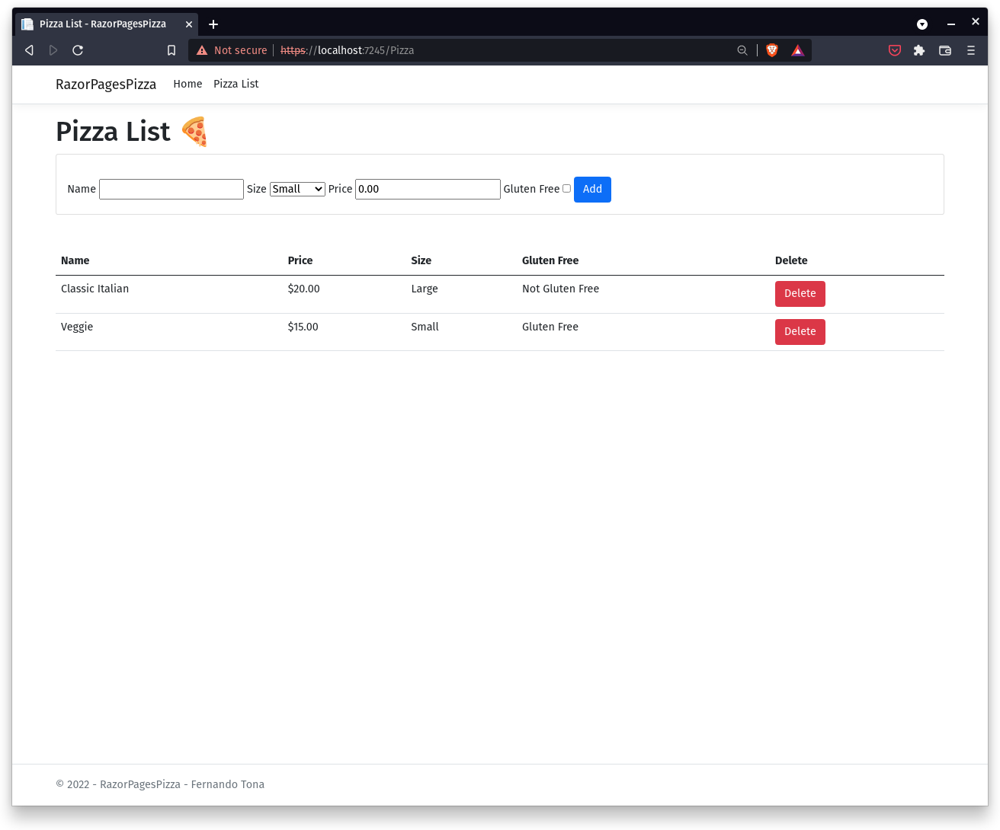
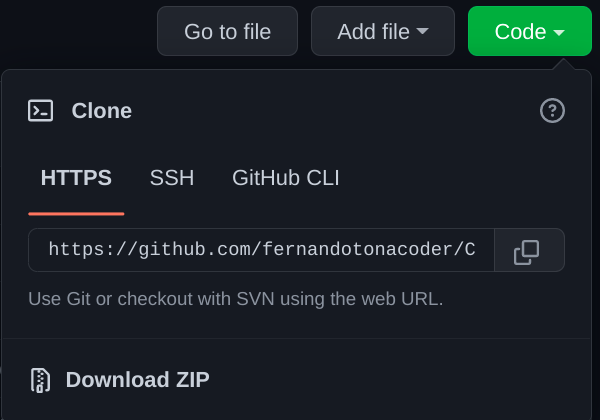

# **RAZOR PAGE PIZZA**

## A simple website under development built by using C#, ASP.NET Core, ASP.NET Razor, HTML, CSS and JavaScript.

### **Context**
Imagine you're an employee of a pizza company named Contoso Pizza.
Your manager has asked you to develop an internal pizza inventory management site.
The site has to support adding, viewing, modifying, and removing types of pizza.
___

### **Current main features**

- CRUD operations (not persisted, still).
___

### **Next Practice Step to implement**
- Persist and retrieve relational data with Entity Framework Core
___

___
 

### **How to run**:

1. Install [Git](https://git-scm.com/book/en/v2/Getting-Started-Installing-Git).
2. Copy the url from above where says "Code" --> "HTTPS".

2. Open your command line terminal and type the following lines (UNIX, GNU/Linux, Windows [Git Bash](https://youtu.be/sQY0g7s2hac)), pressing [Enter] key after each:

\- `cd Downloads`

\- `git clone [copied link]`

[Optional] You can skip all the `Git` stuff and simply click on "Download Zip".

3. Install [.NET](https://dotnet.microsoft.com/en-us/download)

4. Go to the project's downloaded folder via command line terminal and type `dotnet run`.

5. *`ctrl + click`* the *HTTPS* link shown on terminal.

6. Enjoy! ❤️